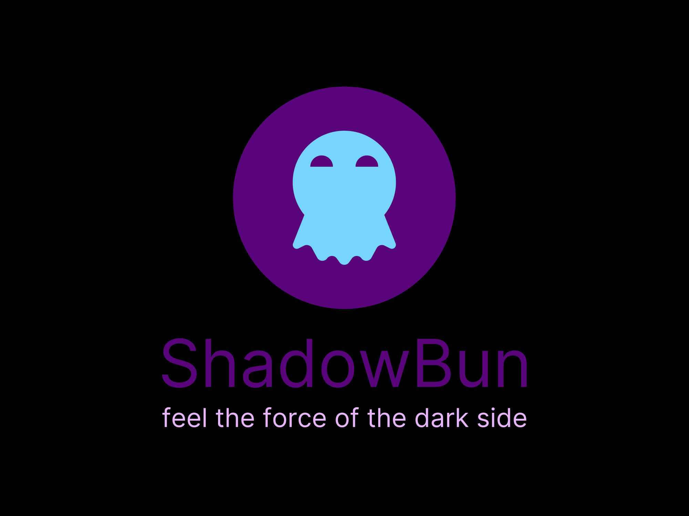

<!-- PROJECT LOGO -->
<br />
<div align="center">
  <a href="https://github.com/othneildrew/shadowbun">
    
  </a>

  <h3 align="center">ShadowBun</h3>

  <p align="center">
    <div>Starter template with Shadcn UI and Tailwind CSS 4 </div>
    <br />
    <a href="https://github.com/Frikadellios/shadowbun"><strong>Explore the docs »</strong></a>
    <br />
    <br />
    <a href="https://github.com/othneildrew/shadowbun">View Demo</a>
    ·
    <a href="https://github.com/othneildrew/shadowbun/issues/new?labels=bug&template=bug-report---.md">Report Bug</a>
    ·
    <a href="https://github.com/othneildrew/shadowbun/issues/new?labels=enhancement&template=feature-request---.md">Request Feature</a>
  </p>
</div>

<!-- TABLE OF CONTENTS -->
<details>
  <summary>Table of Contents</summary>
  <ol>
    <li>
      <a href="#about-the-project">About The Project</a>
      <ul>
        <li><a href="#built-with">Built With</a></li>
      </ul>
    </li>
    <li>
      <a href="#getting-started">Getting Started</a>
      <ul>
        <li><a href="#prerequisites">Prerequisites</a></li>
        <li><a href="#installation">Installation</a></li>
      </ul>
    </li>
    <li><a href="#usage">Usage</a></li>
    <li><a href="#roadmap">Roadmap</a></li>
    <li><a href="#contributing">Contributing</a></li>
    <li><a href="#license">License</a></li>
    <li><a href="#contact">Contact</a></li>
    <li><a href="#acknowledgments">Acknowledgments</a></li>
  </ol>
</details>

<!-- ABOUT THE PROJECT -->
## About The Project

[![Product Name Screen Shot][product-screenshot]](https://example.com)

## 🚀  **Welcome to [Your Project Name]** 🚀

This repository contains... [ Briefly describe your project in 1-2 sentences. ]

**Here's what you'll find:**

* ✨  [Feature 1]
* 🧰  [Feature 2]
* 🤖  [Feature 3]

**Ready to get started?**

* [Link to Documentation/Getting Started Guide]
* [Link to Example Usage]

**Let's build something amazing!** 👍

### Built With

This section should list any major frameworks/libraries used to bootstrap your project. Leave any add-ons/plugins for the acknowledgements section. Here are a few examples.

* [![Astro][Astro.build]][Astro-url]
* [![React][React.js]][React-url]
* [![Shadcn][ui.shadcn.com]][Shadcn-url]
* [![Tailwindcss][tailwindcss.com/blog/tailwindcss-v4-alpha]][Tailwindcss-url]
* [![Biome][biomejs.dev]][Biome-url]
* [![Bun][bun.sh]][Bun-url]
* [![Cloudflare][cloudflare.com]][Cloudflare-url]
* [![Aceternity][ui.aceternity.com]][Aceternity-url]

<p align="right">(<a href="#readme-top">back to top</a>)</p>

<!-- GETTING STARTED -->
## Getting Started

This is an example of how you may give instructions on setting up your project locally.
To get a local copy up and running follow these simple example steps.

### Prerequisites

This is an example of how to list things you need to use the software and how to install them.

* npm

  ```sh
  npm install -g bun # the last `npm` command you'll ever need
  ```

### Installation

_Below is an example of how you can instruct your audience on installing and setting up your app. This template doesn't rely on any external dependencies or services._

1. Get a free template at [https://shadowbun.pages.dev](https://shadowbun.pages.dev)
2. Or Clone the repo

   ```sh
   git clone https://github.com/Frikadellios/shadowbun.git
   ```

3. Install NPM packages

   ```sh
   bun install
   ```

4. Enter your ENV_SECRETS in `.env` and use .env.example SECRETS for Cloudflare deployment or if you use Wrangler for it

   ```js
    API_KEY = 'ENTER YOUR API';
   ```

5. Run Development mode:

   ```sh
   bun run start
   ```

<p align="right">(<a href="#readme-top">back to top</a>)</p>

<!-- USAGE EXAMPLES -->
## Usage

Use this space to show useful examples of how a project can be used. Additional screenshots, code examples and demos work well in this space. You may also link to more resources.

_For more examples, please refer to the [Documentation](https://example.com)_

<p align="right">(<a href="#readme-top">back to top</a>)</p>

<!-- ROADMAP -->
## Roadmap

* [x] Add Changelog
* [x] Add back to top links
* [ ] Add Additional Templates w/ Examples
* [ ] Add "components" document to easily copy & paste sections of the readme
* [ ] Multi-language Support
  * [ ] Chinese
  * [ ] Spanish
  * [ ] Ukrainian
  * [ ] German
  * [ ] Itallian

See the [open issues](https://github.com/othneildrew/shadowbun/issues) for a full list of proposed features (and known issues).

<p align="right">(<a href="#readme-top">back to top</a>)</p>

<!-- CONTRIBUTING -->
## Contributing

Contributions are what make the open source community such an amazing place to learn, inspire, and create. Any contributions you make are **greatly appreciated**.

If you have a suggestion that would make this better, please fork the repo and create a pull request. You can also simply open an issue with the tag "enhancement".
Don't forget to give the project a star! Thanks again!

1. Fork the Project
2. Create your Feature Branch (`git checkout -b feature/AmazingFeature`)
3. Commit your Changes (`git commit -m 'Add some AmazingFeature'`)
4. Push to the Branch (`git push origin feature/AmazingFeature`)
5. Open a Pull Request

<p align="right">(<a href="#readme-top">back to top</a>)</p>

<!-- LICENSE -->
## License

Distributed under the MIT License. See `LICENSE.txt` for more information.

<p align="right">(<a href="#readme-top">back to top</a>)</p>

<!-- CONTACT -->
## Contact

Creator - [Frikadellios](https://github.com/Frikadellios)

Project Link: [ShadowBun](https://github.com/Frikadellios/shadowbun)

<p align="right">(<a href="#readme-top">back to top</a>)</p>

<!-- ACKNOWLEDGMENTS -->
## Acknowledgments

Use this space to list resources you find helpful and would like to give credit to. I've included a few of my favorites to kick things off!

* [Choose an Open Source License](https://choosealicense.com)
* [GitHub Emoji Cheat Sheet](https://www.webpagefx.com/tools/emoji-cheat-sheet)
* [Malven's Flexbox Cheatsheet](https://flexbox.malven.co/)
* [Malven's Grid Cheatsheet](https://grid.malven.co/)
* [Img Shields](https://shields.io)
* [GitHub Pages](https://pages.github.com)
* [Font Awesome](https://fontawesome.com)
* [React Icons](https://react-icons.github.io/react-icons/search)

<p align="right">(<a href="#readme-top">back to top</a>)</p>

<!-- MARKDOWN LINKS & IMAGES -->
<!-- https://www.markdownguide.org/basic-syntax/#reference-style-links -->
[product-screenshot]: images/screenshot.png
[React.js]: https://img.shields.io/badge/React-20232A?style=for-the-badge&logo=react&logoColor=61DAFB
[React-url]: https://reactjs.org/
[ui.shadcn.com]: https://img.shields.io/badge/shadcn%2Fui-000000?style=for-the-badge&logo=shadcnui&logoColor=white
[Shadcn-url]: https://ui.shadcn.com/
[tailwindcss.com/blog/tailwindcss-v4-alpha]: https://img.shields.io/badge/Tailwind_CSS-38B2AC?style=for-the-badge&logo=tailwind-css&logoColor=white
[Tailwindcss-url]: https://tailwindcss.com/
[biomejs.dev]: https://img.shields.io/badge/Biome-60A5FA?style=for-the-badge&logo=biome&logoColor=white
[Biome-url]: https://biomejs.dev/
[bun.sh]: https://img.shields.io/badge/Bun-000000?style=for-the-badge&logo=bun&logoColor=white
[Bun-url]: https://bun.sh/
[cloudflare.com]: https://img.shields.io/badge/Cloudflare-F38020?style=for-the-badge&logo=cloudflare&logoColor=white
[Cloudflare-url]: https://www.cloudflare.com/
[ui.aceternity.com]: https://img.shields.io/badge/Aceternity-000000?style=for-the-badge&logo=aceternity&logoColor=white
[Aceternity-url]: https://ui.aceternity.com/

[Astro.build]: https://img.shields.io/badge/Astro-0C1222?style=for-the-badge&logo=astro&logoColor=FDFDFE
[Astro-url]: https://astro.build/
